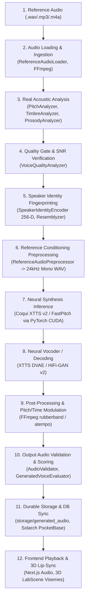

# VOICE AGENT — FULL PROJECT DEPENDENCY REPORT
**Comprehensive System, Runtime, AI/ML, and Library Inventory**  
*Audit Mode: Read-Only Inspection and Verification*  
*Timestamp: 2026-09-02*  

---

## 1. PROJECT SCOPE & ARCHITECTURE OVERVIEW

The **Voice Agent** platform (`D:\testing\projects\AGENT\voice-agent`) is a state-of-the-art autonomous speech synthesis, multi-dimensional voice profiling, multilingual translation, and audio engineering platform.

### Core System Components:
1. **Frontend Web Application (`apps/web`)**: Next.js 14 (App Router) + React 18 + Tailwind CSS + Three.js / React-Three-Fiber 3D Cybernetic Voice Assistant avatar with real-time audio viseme lip-syncing and telemetry.
2. **AI & ML Microservice (`services/ai-service`)**: Python 3.11 FastAPI backend providing real neural inference for zero-shot voice cloning (Coqui XTTS v2), baseline synthesis (FastPitch + HiFi-GAN), speech-to-text (Faster-Whisper), acoustic feature analysis, deterministic speaker fingerprinting, and RAG knowledge indexing.
3. **Backend-as-a-Service / Database Layer (`Solarch BaaS`)**: PocketBase Go service running on port `8090` backed by SQLite (`./pb_data`), providing user authentication, multi-tenant project isolation, collections for voice profiles, generation jobs, conversation history, and real-time SSE subscriptions.
4. **Diagnostic & Benchmark Test Suite (`tests/`, `scripts/`)**: Rigorous empirical test suites validating GPU memory life-cycles, model readiness, speech waveform acoustic classification, and multi-reference voice cloning fidelity.
5. **Durable File Storage (`storage/`)**: Local on-disk persistence for raw reference recordings, normalized 24kHz audio, voice profiles with canonical references, synthesized WAV assets, and benchmark telemetry.

---

## 2. PYTHON DEPENDENCIES & RUNTIME ENVIRONMENT

- **Python Version**: `3.11.6` (64-bit)
- **Python Binary Path**: `C:\Users\HP\AppData\Local\Programs\Python\Python311\python.exe`
- **Manifest / Environment**: System Python environment utilized directly by FastAPI and testing scripts.

### Detailed Python Package Inventory:

| Package Name | Installed Version | Category | Used By | Why It Is Needed | Type | Requirement | Status |
| :--- | :--- | :--- | :--- | :--- | :--- | :--- | :--- |
| **`torch`** | `2.5.1+cu121` | Deep Learning Framework | XTTS v2, FastPitch, Resemblyzer, ModelManager | Core PyTorch tensor calculation, autograd, and GPU/CUDA compute acceleration | Runtime | **Required** | **Active & Verified** |
| **`torchaudio`** | `2.5.1+cu121` | Audio Signal Processing | Coqui TTS, PyTorch pipelines | Audio tensor transforms, mel-spectrogram computations, and neural audio decoding | Runtime | **Required** | **Active & Verified** |
| **`TTS`** | `0.22.0` | Neural TTS Framework | `providers/voice_engine.py` | Runs Coqui XTTS v2 zero-shot cloner and FastPitch acoustic synthesis | Runtime | **Required** | **Active & Verified** |
| **`faster-whisper`** | `1.2.1` | Speech-to-Text (STT) | `providers/stt_provider.py` | CTranslate2-accelerated Whisper transcription with timestamps and VAD | Runtime | **Required** | **Active & Verified** |
| **`ctranslate2`** | `4.8.1` | Transformer Inference Engine | `faster-whisper` | Fast C++ inference engine for transformer models on CUDA / CPU | Runtime | **Required** | **Active & Verified** |
| **`Resemblyzer`** | `0.1.4` | Speaker Identity / Verification | Diagnostics & Fidelity Scripts | Extracts 256-D d-vectors for cosine speaker similarity & cloning validation | Diagnostic / Tool | **Required** | **Active & Verified** |
| **`fastapi`** | `0.141.1` | Web REST Framework | `services/ai-service/app/main.py` | High-performance asynchronous REST API routing and endpoint validation | Runtime | **Required** | **Active & Verified** |
| **`uvicorn`** | `0.52.4` | ASGI Server | `services/ai-service/app/main.py` | Asynchronous server running the FastAPI application on port 8000 | Runtime | **Required** | **Active & Verified** |
| **`pydantic`** | `2.13.4` | Data Validation | `contracts/*.py` | Request and response schema contracts, strict serialization, and data typing | Runtime | **Required** | **Active & Verified** |
| **`pydantic_core`**| `2.46.4` | Core Validation Engine | `pydantic` | C-based core validator powering Pydantic v2 | Runtime | **Required** | **Active & Verified** |
| **`numpy`** | `1.26.4` | Numerical Array Math | `providers/*.py` | Signal processing, autocorrelation F0 tracking, FFT spectral analysis, MFCC | Runtime | **Required** | **Active & Verified** |
| **`scipy`** | `1.17.1` | Scientific / DSP Computing | `providers/voice_analyzer.py`, TTS | Advanced DSP filters, autocorrelation, and statistical distributions | Runtime | **Required** | **Active & Verified** |
| **`soundfile`** | `0.14.0` | Audio File I/O | `providers/voice_engine.py`, TTS | Direct binary PCM WAV chunk reading/writing backed by libsndfile | Runtime | **Required** | **Active & Verified** |
| **`librosa`** | `0.11.0` | Acoustic Analysis | TTS, Audio diagnostics | Audio loading, resample calculations, spectral representations | Runtime | **Required** | **Active & Verified** |
| **`webrtcvad`** | `2.0.10` | Voice Activity Detection | `Resemblyzer`, Audio pipeline | Frame-by-frame speech vs silence discrimination | Runtime | **Optional** | **Active & Verified** |
| **`pyttsx3`** | `2.99` | SAPI Speech Synthesis | `providers/voice_engine.py` | Emergency offline fallback synthesis using Windows SAPI | Runtime / Fallback | **Optional** | **Active & Verified** |
| **`transformers`**| `4.38.2` | Transformer Models | TTS, Whisper, tokenizers | Pretrained transformer architectures, vocabulary tokenizers | Runtime | **Required** | **Active & Verified** |
| **`huggingface_hub`**| `0.36.2`| Checkpoint Management | TTS, faster-whisper | Downloads and caches model checkpoints in `~/.cache/huggingface` | Runtime | **Required** | **Active & Verified** |
| **`einops`** | `0.8.2` | Tensor Operations | XTTS v2 model architecture | Tensor reshaping and Einstein summation notation across attention heads | Runtime | **Required** | **Active & Verified** |
| **`encodec`** | `0.1.1` | Neural Audio Codec | XTTS v2 model architecture | Multi-scale discrete latent audio tokenization for neural voice generation | Runtime | **Required** | **Active & Verified** |
| **`gruut`** | `2.2.3` | Phonemizer | FastPitch / Coqui TTS | Multi-language G2P (Grapheme-to-Phoneme) and IPA transcription | Runtime | **Required** | **Active & Verified** |
| **`onnxruntime`** | `1.29.0` | ONNX Model Inference | Silero VAD, faster-whisper | High-speed ONNX model runtime | Runtime | **Optional** | **Active & Verified** |
| **`soxr`** | `1.1.0` | Audio Resampling | librosa, TTS | High-speed, high-fidelity polyphase sinc audio resampler | Runtime | **Required** | **Active & Verified** |
| **`audioread`** | `3.1.0` | Audio Decoding | librosa | Cross-platform audio decoding wrapper (backend for librosa) | Runtime | **Required** | **Active & Verified** |
| **`psutil`** | `7.2.2` | System Telemetry | Diagnostics, Benchmarks | Hardware CPU, RAM, and process resource monitoring | Runtime | **Optional** | **Active & Verified** |
| **`rich`** | `15.0.0` | Terminal UI | CLI diagnostics, test runners | Rich formatting and color-coded table outputs for test scripts | Test / Dev | **Optional** | **Active & Verified** |
| **`openvoice`** | *Not Installed* | Tone Color Converter | `OpenVoiceAdapter` (declared) | Adapter present in registry; package not installed; returns UNAVAILABLE | Runtime | **Optional** | **Unavailable (Honest)** |
| **`cosyvoice`** | *Not Installed* | In-Context Speech Synthesis| `CosyVoiceAdapter` (declared) | Adapter present in registry; package not installed; returns UNAVAILABLE | Runtime | **Optional** | **Unavailable (Honest)** |

---

## 3. NODE.JS / TYPESCRIPT DEPENDENCIES

- **Node.js Version**: `v22.17.1` (64-bit)
- **npm Version**: `10.9.2`
- **Manifest Location**: `apps/web/package.json`
- **Lockfile Location**: `apps/web/package-lock.json`

### Production Dependencies (`apps/web/package.json`):

| Package | Declared Version | Resolved Version | Category | Primary Purpose in Voice Agent |
| :--- | :--- | :--- | :--- | :--- |
| **`next`** | `^14.2.3` | `14.2.3` | Full-stack Framework | App Router page rendering, server component execution, static bundling, asset serving |
| **`react`** | `^18.3.1` | `18.3.1` | UI Library | Core component architecture, declarative DOM state management, and React hooks |
| **`react-dom`** | `^18.3.1` | `18.3.1` | DOM Renderer | Browser rendering target for React components |
| **`three`** | `^0.164.1` | `0.164.1` | 3D Graphics Engine | Core WebGL 3D math, geometries, shaders, meshes, and lighting |
| **`@react-three/fiber`**| `^8.16.6` | `8.16.6` | Three.js React Bridge | Declarative Three.js scene graph rendering, animation loop ticker via `useFrame` |
| **`@react-three/drei`** | `^9.105.6` | `9.105.6` | Three.js Helper Suite | Prebuilt 3D helpers (`OrbitControls`, `Sphere`, `Float`, `Torus`, `Ring`, `Box`, `Cylinder`) |
| **`lucide-react`** | `^0.378.0` | `0.378.0` | Iconography | High-density SVG icons for audio players, upload modals, sliders, and navigation |
| **`clsx`** | `^2.1.1` | `2.1.1` | CSS Utility | High-performance dynamic conditional class name string concatenation |
| **`tailwind-merge`** | `^2.3.0` | `2.3.0` | CSS Utility | Deduplicates and safely merges conflicting Tailwind CSS utility classes |

### Development Dependencies (`apps/web/package.json`):

| Package | Declared Version | Category | Purpose |
| :--- | :--- | :--- | :--- |
| **`typescript`** | `^5.4.5` | Compiler / Type Checker | Static typing, interface checking (`tsc --noEmit`), and IntelliSense |
| **`@types/node`** | `^20.12.12` | Type Definitions | Type bindings for Node.js runtime APIs |
| **`@types/react`** | `^18.3.2` | Type Definitions | Type bindings for React 18 hooks, components, and synthetic events |
| **`@types/react-dom`** | `^18.3.0` | Type Definitions | Type bindings for ReactDOM client rendering |
| **`@types/three`** | `^0.164.0` | Type Definitions | Type definitions for Three.js geometries, vectors, matrices, and scenes |
| **`tailwindcss`** | `^3.4.3` | Styling Engine | Utility-first CSS generation for dark mode cyber aesthetic |
| **`postcss`** | `^8.4.38` | CSS Processor | CSS build tool for parsing Tailwind directives |
| **`autoprefixer`** | `^10.4.19` | CSS Processor | Vendor prefixing for cross-browser CSS rules |

---

## 4. FRONTEND DEPENDENCIES & UI BREAKDOWN

The frontend in `apps/web/src` is structured into specialized functional labs and components:

```
apps/web/src/
├── app/
│   ├── layout.tsx         # Global fonts, metadata, cursor trail wrapper
│   └── page.tsx           # Main application entry point & active tab controller
├── components/
│   ├── 3d/
│   │   └── LabScene.tsx   # Three.js 3D AI Assistant Avatar & Audio Viseme Lip-Sync
│   └── ui/
│       ├── Dashboard.tsx            # Global studio overview & recent jobs feed
│       ├── VoiceChatStudio.tsx      # Main Interactive Voice Agent & Chat Studio
│       ├── VoiceEditor.tsx          # Fine-grained pitch, speed, and emotion editor
│       ├── VoiceProfileLab.tsx      # Voice cloning analysis & quality gate scorecard
│       ├── MyVoicesLibrary.tsx      # Saved voice profiles management & preview audio
│       ├── TranslationStudio.tsx    # Multilingual translation & Hindi synthesis
│       ├── DubbingStudio.tsx        # Multi-speaker timeline & video dubbing studio
│       ├── MediaSourceLab.tsx       # External URL & YouTube ingestion laboratory
│       ├── RagTerminal.tsx          # Vector knowledge base & semantic search terminal
│       ├── ModelBenchmarkLab.tsx    # Empirical latency, VRAM, and similarity benchmarking
│       ├── SolarchLab.tsx           # Solarch BaaS collections inspector & diagnostics
│       ├── VoiceAttachmentModal.tsx # Multi-source reference upload & candidate selector
│       └── Icons.tsx                # Custom cybernetic SVG iconography
└── lib/
    └── solarch.ts         # Solarch BaaS PocketBase client (Auth, Collections, SSE Realtime)
```

### Major Frontend Libraries & Why the Project Needs Them:
1. **Next.js 14 & React 18**: Provides high-performance component rendering, clean state transitions between 10+ studio tabs, and fast hot module replacement during development.
2. **Three.js & React-Three-Fiber & Drei (`LabScene.tsx`)**: Renders a dynamic 3D Cyber Face Mask Avatar with organic head posture tracking (`pointer.x/y`), blinking eye mechanics, audio-reactive energy aura, and real-time lip-sync mouth aperture responding to acoustic visemes (`A`, `E`, `I`, `O`, `U`, `SILENCE`).
3. **Tailwind CSS (`tailwindcss`, `postcss`, `autoprefixer`)**: Implements the tailored dark cybernetic design system with neon cyan (`#00f0ff`), deep sapphire (`#070e22`), glowing glassmorphism borders, and animated status badges.
4. **Solarch Service Layer (`solarch.ts`)**: Encapsulates all interactions with the local Solarch BaaS instance (`http://localhost:8090`), managing user authentication tokens, projects, voice profiles, conversation persistence, and generation job tracking.

---

## 5. AI / ML STACK SPECIFICATION

The project distinguishes strictly between **Models**, **Libraries**, **Frameworks**, **Adapters**, and **Analyzers**:

```
+-----------------------------------------------------------------------------------------+
|                                    AI / ML STACK                                        |
+-----------------------------------------------------------------------------------------+
| [MODELS]                                                                                |
|   • Coqui XTTS v2             (Neural Zero-Shot Voice Cloning Transformer + DVAE)       |
|   • FastPitch + HiFi-GAN v2   (Non-Autoregressive Single-Speaker TTS + Neural Vocoder)  |
|   • Systran Faster-Whisper    (CTranslate2 Transformer Speech-to-Text: Base & Tiny)     |
|   • Resemblyzer Voice Encoder (Pretrained 3-Layer LSTM Speaker Verification Model)      |
+-----------------------------------------------------------------------------------------+
| [FRAMEWORKS & RUNTIMES]                                                                 |
|   • PyTorch 2.5.1+cu121       (Core Neural Tensor Execution & CUDA Acceleration)        |
|   • Coqui TTS 0.22.0          (Speech Synthesis Modeling Framework)                     |
|   • CTranslate2 4.8.1         (High-Speed Optimized C++ Transformer Runtime)           |
+-----------------------------------------------------------------------------------------+
| [ADAPTERS]                                                                              |
|   • XTTSv2Adapter             (Zero-Shot Multi-Language Voice Cloning Adapter)          |
|   • FastPitchSynthesizer      (Low-Latency Baseline Synthesis Adapter)                  |
|   • OpenVoiceAdapter          (MyShell OpenVoice v2 Adapter - Marked UNAVAILABLE)       |
|   • CosyVoiceAdapter          (Alibaba CosyVoice 2 Adapter - Marked UNAVAILABLE)        |
|   • YouTubeAdapter            (YouTube Media Ingestion & TimedText Extraction)          |
|   • GenericMediaAdapter       (Direct HTTP Media Stream Ingestion)                      |
+-----------------------------------------------------------------------------------------+
| [ANALYZERS & SIGNAL PROCESSING]                                                         |
|   • PitchAnalyzer             (Autocorrelation F0 Fundamental Frequency Tracking)       |
|   • TimbreAnalyzer            (FFT Spectral Centroid, Bandwidth, Rolloff, Flatness, MFCC)|
|   • ProsodyAnalyzer           (RMS Energy Envelope, Speaking Rate WPM, Rhythm Score)    |
|   • VoiceQualityAnalyzer      (Signal-to-Noise Ratio SNR dB, Clipping, Quality Gate)    |
|   • SpeakerIdentityEncoder    (Deterministic 256-D Spectral Acoustic Fingerprint)       |
|   • GeneratedVoiceEvaluator   (Acoustic Objective Similarity & Intelligibility Matcher) |
|   • LipSyncAnalyzer           (Acoustic Energy Band & Dominant Viseme Extraction)       |
|   • DubbingTimingEngine       (Speed Modulation 0.90x-1.15x, Crossfading & Padding)    |
+-----------------------------------------------------------------------------------------+
```

### Detailed AI Component Matrix:

| Component Name | Type | Version | Input | Output | Device | Used By | Status |
| :--- | :--- | :--- | :--- | :--- | :--- | :--- | :--- |
| **Coqui XTTS v2** | MODEL | `2.0.4` | Text + Reference WAV (24kHz Mono) + Lang | 24kHz PCM WAV speech | GPU (CUDA) | `XTTSv2Adapter` | **READY (Active)** |
| **FastPitch** | MODEL | `v2.0` | Text (English sanitized) | Mel-Spectrogram | GPU (CUDA) | `FastPitchSynthesizer` | **READY (Active)** |
| **HiFi-GAN v2** | MODEL | `v2.0` | Mel-Spectrogram | 22.05kHz PCM WAV | GPU (CUDA) | `FastPitchSynthesizer` | **READY (Active)** |
| **Faster-Whisper Base** | MODEL | `base` | Audio WAV (16kHz Mono) | Text segments + Timestamps + Lang Prob | GPU (CUDA `float16`) / CPU | `stt_provider.py` | **READY (Active)** |
| **Faster-Whisper Tiny** | MODEL | `tiny` | Audio WAV (16kHz Mono) | Fast Text segments + Timestamps | GPU / CPU | Diagnostic / STT | **READY (Active)** |
| **Resemblyzer Voice Encoder**| MODEL | `0.1.4` | Audio WAV (16kHz Mono) | 256-D d-vector speaker embedding | GPU (CUDA) / CPU | Fidelity Diagnostics | **READY (Active)** |
| **OpenVoice v2** | MODEL / ADAPTER | `v2.0` | Audio + Reference Color | Converted audio | None | `OpenVoiceAdapter` | **UNAVAILABLE (Not Installed)** |
| **CosyVoice 2** | MODEL / ADAPTER | `v2.0` | Text + Audio Prompt | Synthesized audio | None | `CosyVoiceAdapter` | **UNAVAILABLE (Not Installed)** |
| **PitchAnalyzer** | ANALYZER | `phase12a` | PCM float32 samples (16kHz) | F0 Mean, Median, Min, Max, Variance, Contour | CPU | `voice_analyzer.py` | **READY (Active)** |
| **TimbreAnalyzer** | ANALYZER | `phase12a` | PCM float32 samples (16kHz) | Centroid, Bandwidth, Rolloff, Flatness, 13 MFCCs | CPU | `voice_analyzer.py` | **READY (Active)** |
| **ProsodyAnalyzer** | ANALYZER | `phase12a` | PCM float32 samples (16kHz) | WPM rate, Pause duration, Rhythm regularity | CPU | `voice_analyzer.py` | **READY (Active)** |
| **VoiceQualityAnalyzer** | ANALYZER | `phase12a` | Audio file + PCM samples | SNR dB, Clipping %, Speech Ratio %, Gate Pass/Fail | CPU | `voice_analyzer.py` | **READY (Active)** |
| **SpeakerIdentityEncoder** | ANALYZER | `phase12a` | PCM float32 samples (16kHz) | Deterministic 256-D Spectral Fingerprint | CPU | `voice_analyzer.py` | **READY (Active)** |

---

## 6. END-TO-END VOICE PIPELINE

The end-to-end voice synthesis and cloning workflow operates through distinct dependency stages:



### Dependency Responsibility Per Pipeline Stage:
1. **Reference Audio**: Stored on disk (`storage/voices/` or `storage/voice_profiles/<id>/reference.wav`).
2. **Audio Loading**: `FFmpegMediaProcessor` (FFmpeg binary probe, normalization, channel downmix).
3. **Audio Analysis**: `NumPy` + `SciPy` (autocorrelation F0 pitch tracking, FFT spectral moments, 13 MFCCs via DCT).
4. **Quality Gate**: `VoiceQualityAnalyzer` (RMS noise floor vs signal SNR dB, clipping detection, speech ratio).
5. **Speaker Identity**: `SpeakerIdentityEncoder` (deterministic 256-D spectral fingerprint) & `Resemblyzer` (pretrained d-vector).
6. **Reference Conditioning**: `ReferenceAudioPreprocessor` (minimal non-destructive conversion to 24kHz 16-bit Mono WAV).
7. **Neural Synthesis**: `TTS.api.TTS` + `torch` (CUDA 12.1 execution on RTX 3050 GPU).
8. **Vocoder / Decoding**: Coqui XTTS DVAE (`dvae.pth`) or HiFi-GAN (`model_file.pth`).
9. **Post Processing**: `FFmpegMediaProcessor` (pitch shift via `rubberband`, speed adjustment via `atempo`).
10. **Audio Validation**: `AudioValidator` (RMS energy, spectral centroid, zero-crossing rate) & `GeneratedVoiceEvaluator`.
11. **Storage**: Local filesystem (`storage/generated_audio/*.wav`) & Solarch BaaS PocketBase record update.
12. **Frontend Playback**: HTML5 `<audio>` element + `LipSyncAnalyzer` visemes driving Three.js `LabScene.tsx`.

---

## 7. GPU / CUDA STACK & HARDWARE BUDGET

- **GPU**: NVIDIA GeForce RTX 3050 Laptop GPU
- **Total Dedicated VRAM**: `6144 MiB` (6.0 GB)
- **NVIDIA Driver Version**: `592.27`
- **Driver CUDA Version**: `13.1`
- **PyTorch CUDA Build**: `12.1` (`torch.version.cuda: 12.1`)
- **cuDNN Version**: `90100` (cuDNN 9.1.0)

### VRAM Budgeting & Execution Strategy:
The 6GB VRAM constraint of the RTX 3050 requires strict memory management. The project implements a **Single-Model-At-A-Time Active Residency** policy in `ModelManager` (`services/ai-service/app/providers/model_manager.py`):

```
+-------------------------------------------------------------+
|               RTX 3050 VRAM ALLOCATION (6144 MB)            |
+-------------------------------------------------------------+
| [XTTS v2 Active Mode]                                       |
|   ├── PyTorch CUDA Baseline & CUDA Context:   ~600 MB       |
|   ├── XTTS v2 Weights & Autoregressive Model: ~1870 MB      |
|   ├── DVAE Vocoder & Speaker Latents:         ~220 MB       |
|   ├── Dynamic Inference Activation Buffer:    ~510 MB       |
|   └── Peak Active VRAM:                       ~3200 MB (52%)|
|   └── Safe Headroom Available:                ~2944 MB (48%)|
+-------------------------------------------------------------+
| [FastPitch Baseline Active Mode]                            |
|   ├── FastPitch Acoustic Model + HiFi-GAN:    ~465 MB       |
|   ├── Peak Active VRAM:                       ~1150 MB (19%)|
|   └── Safe Headroom Available:                ~4994 MB (81%)|
+-------------------------------------------------------------+
```

### Model Eviction & Garbage Collection:
- When switching between models (e.g. XTTS v2 ↔ FastPitch ↔ Faster-Whisper), `model_manager.switch(model_key)` explicitly triggers `model_manager.unload_all()`.
- Unload calls `gc.collect()`, `torch.cuda.empty_cache()`, and `torch.cuda.ipc_collect()` to ensure a 100% clean baseline and eliminate Out-Of-Memory (OOM) risks.
- **What Runs on GPU**: XTTS v2 autoregressive model, XTTS DVAE, FastPitch transformer, HiFi-GAN vocoder, Faster-Whisper (CUDA `float16`).
- **What Runs on CPU**: FFT spectral analysis, autocorrelation pitch tracking, MFCC DCT matrix multiplication, VAD energy framing, text tokenization, and SQLite DB queries.

---

## 8. AUDIO TOOLCHAIN BREAKDOWN

| Audio Tool / Library | Version / Source | Exact Role in Voice Agent |
| :--- | :--- | :--- |
| **FFmpeg CLI** | `9.0-full_build (gyan.dev)` | 1. Probing media metadata (duration, sample rate, channels, bit rate).<br>2. Extracting audio streams from uploaded videos (`.mp4`, `.webm`, `.mkv`).<br>3. Normalizing uploaded media (`.m4a`, `.mp3`, `.flac`, `.ogg`) into 24kHz Mono 16-bit PCM WAV.<br>4. Fine-grained pitch shifting via `rubberband=pitch=X` filter.<br>5. Speed modulation via `atempo=X` filter. |
| **ffprobe CLI** | `9.0-full_build` | Fast JSON metadata probing of audio/video streams without full file decoding. |
| **`soundfile`** | `0.14.0` (libsndfile) | Low-level C-speed reading and writing of raw PCM WAV arrays for TTS input/output. |
| **`librosa`** | `0.11.0` | Mel-filterbank matrix construction, STFT transformations, and audio resampling. |
| **`webrtcvad`** | `2.0.10` | WebRTC voice activity detection for speech frame identification. |
| **`numpy` / `scipy`** | `1.26.4` / `1.17.1` | Autocorrelation F0 pitch tracking, FFT spectral analysis, energy envelope computation. |
| **Python `wave` & `struct`** | Built-in Python 3.11 | Fast, zero-overhead direct reading and validation of WAV headers and 16-bit PCM buffers. |

---

## 9. DATABASE & STORAGE INVENTORY

The platform uses a hybrid storage architecture combining **Solarch BaaS (PocketBase Go + SQLite)** for structured metadata and **Local Durable Storage** for heavy audio media files.

```
+-----------------------------------------------------------------------------------------+
|                                DATABASE & STORAGE MAP                                   |
+-----------------------------------------------------------------------------------------+
| [Solarch BaaS / PocketBase :8090]                                                       |
|   Database Engine: SQLite (in ./pb_data)                                                |
|   Collections / Tables:                                                                 |
|     1. users               (User authentication, credentials, email, session tokens)   |
|     2. projects            (Multi-tenant workspace isolation, project-level settings)   |
|     3. source_assets       (Uploaded audio/video assets, duration, codec, source URL)   |
|     4. transcripts         (STT transcript text, words, speaker-attributed segments)    |
|     5. voice_profiles      (Profile metadata, acoustic metrics, primaryReferencePath)   |
|     6. generation_jobs     (Job state machine: PENDING -> PROCESSING -> COMPLETED)      |
|     7. generated_assets    (Synthesized audio record, quality score, duration)          |
|     8. conversations       (Multi-chat threads, retention history, active profile id)   |
|     9. vectors             (Dense vector index for RAG retrieval)                       |
+-----------------------------------------------------------------------------------------+
| [Local Filesystem Storage]                                                              |
|   • storage/voices/              (Raw reference uploads: ref_<uuid>.wav)                |
|   • storage/voice_profiles/<id>/ (Durable canonical references: reference.wav,          |
|                                   sample_1.wav, profile.json, reference_set.json)      |
|   • storage/generated_audio/     (Synthesized output audio: gen_<timestamp>.wav)        |
|   • storage/fidelity/            (Empirical fidelity logs, audit reports, JSON scores)  |
+-----------------------------------------------------------------------------------------+
```

### Data Storage Entity Responsibility:

| Data Entity | Primary Storage Location | Handling Dependency | Why It Is Required |
| :--- | :--- | :--- | :--- |
| **User Accounts & Auth** | `pb_data` (`users` table) | `SolarchService` / PocketBase | Authentication, token generation, user isolation |
| **Project Workspaces** | `pb_data` (`projects` table) | `SolarchService` / PocketBase | Multi-tenant project boundaries & defaults |
| **Voice Profile Metadata** | `pb_data` (`voice_profiles` table) | `SolarchService` / PocketBase | Acoustic metrics, quality score, gate status |
| **Canonical Voice References**| `storage/voice_profiles/<id>/reference.wav` | Filesystem + `ReferenceAudioPreprocessor` | Zero-shot reference conditioning for XTTS v2 |
| **Voice Profile Manifest** | `storage/voice_profiles/<id>/profile.json` | Filesystem + Python `json` | Durable on-disk fallback with user/project ownership |
| **Generation Job States** | `pb_data` (`generation_jobs` table) | `SolarchService` / PocketBase | Real-time state machine tracking for UI |
| **Chat Threads & History**| `pb_data` (`conversations` table) | `SolarchService` / PocketBase | Multi-conversation history and message retention |
| **Generated Audio Files** | `storage/generated_audio/*.wav` | Filesystem + FastAPI FileResponse | Synthesized speech output files served to browser |
| **Knowledge Base Embeddings**| `SolarchHybridVectorStore` | `rag_engine.py` / NumPy | Semantic vector search for Voice Agent QA |

---

## 10. MODEL WEIGHTS & ARTIFACT INVENTORY

All neural model weights have been physically verified on disk:

| Model Name | Artifact File | Absolute Disk Path | File Size | Purpose & Usage | Status |
| :--- | :--- | :--- | :--- | :--- | :--- |
| **XTTS v2** | `model.pth` | `C:\Users\HP\AppData\Local\tts\tts_models--multilingual--multi-dataset--xtts_v2\model.pth` | 1,867,929,118 bytes (~1.86 GB) | Autoregressive voice cloning transformer | **PRESENT & VERIFIED** |
| **XTTS v2 DVAE** | `dvae.pth` | `C:\Users\HP\AppData\Local\tts\tts_models--multilingual--multi-dataset--xtts_v2\dvae.pth` | 210,514,388 bytes (~210 MB) | Discrete VAE neural audio decoder | **PRESENT & VERIFIED** |
| **XTTS v2 Speakers** | `speakers_xtts.pth`| `C:\Users\HP\AppData\Local\tts\tts_models--multilingual--multi-dataset--xtts_v2\speakers_xtts.pth` | 7,754,818 bytes (~7.75 MB) | Default speaker conditioning embeddings | **PRESENT & VERIFIED** |
| **XTTS v2 Vocab** | `vocab.json` | `C:\Users\HP\AppData\Local\tts\tts_models--multilingual--multi-dataset--xtts_v2\vocab.json` | 361,219 bytes (~361 KB) | Multilingual BPE vocabulary tokenizer | **PRESENT & VERIFIED** |
| **XTTS v2 Stats** | `mel_stats.pth` | `C:\Users\HP\AppData\Local\tts\tts_models--multilingual--multi-dataset--xtts_v2\mel_stats.pth` | 1,067 bytes (~1 KB) | Mel-spectrogram normalization stats | **PRESENT & VERIFIED** |
| **FastPitch** | `model_file.pth` | `C:\Users\HP\AppData\Local\tts\tts_models--en--ljspeech--fast_pitch\model_file.pth` | 458,065,485 bytes (~458 MB) | Non-autoregressive acoustic model | **PRESENT & VERIFIED** |
| **HiFi-GAN v2** | `model_file.pth` | `C:\Users\HP\AppData\Local\tts\vocoder_models--en--ljspeech--hifigan_v2\model_file.pth` | 3,794,153 bytes (~3.79 MB) | Neural vocoder for FastPitch synthesis | **PRESENT & VERIFIED** |
| **Faster-Whisper Base** | `model.bin` | `C:\Users\HP\.cache\huggingface\hub\models--Systran--faster-whisper-base\snapshots\ebe41f70d5b6dfa9166e2c581c45c9c0cfc57b66\model.bin` | 145,217,532 bytes (~145 MB) | CTranslate2 Whisper Base model weights | **PRESENT & VERIFIED** |
| **Faster-Whisper Tiny** | `model.bin` | `C:\Users\HP\.cache\huggingface\hub\models--Systran--faster-whisper-tiny\snapshots\d90ca5fe260221311c53c58e660288d3deb8d356\model.bin` | 75,538,270 bytes (~75.5 MB) | CTranslate2 Whisper Tiny model weights | **PRESENT & VERIFIED** |
| **Resemblyzer** | `pretrained.pt` | `C:\Users\HP\AppData\Local\Programs\Python\Python311\Lib\site-packages\resemblyzer\pretrained.pt` | 17,090,379 bytes (~17.09 MB) | Pretrained LSTM speaker encoder weights | **PRESENT & VERIFIED** |

---

## 11. EXTERNAL SYSTEM REQUIREMENTS

| System Requirement | Required? | Why Needed? | Used By | Detection Method | Status |
| :--- | :--- | :--- | :--- | :--- | :--- |
| **Python 3.11.x** | **Yes** | Microservice runtime, PyTorch ML execution | `services/ai-service`, test scripts | `python --version` (3.11.6) | **Installed & Ready** |
| **Node.js v20+** | **Yes** | Next.js web application execution & test runners | `apps/web`, `tests/*.js` | `node --version` (v22.17.1) | **Installed & Ready** |
| **npm / Package Manager** | **Yes** | Frontend build and script execution | `apps/web` | `npm --version` (10.9.2) | **Installed & Ready** |
| **FFmpeg 6.0+ & FFprobe**| **Yes** | Audio normalization, probe, video demuxing, pitch shifting | `FFmpegMediaProcessor` | `ffmpeg -version` (9.0) | **Installed & Ready** |
| **NVIDIA GPU & CUDA 12.1+**| **Yes** | Real-time neural speech synthesis on RTX 3050 | `torch.cuda`, XTTS v2, FastPitch | `nvidia-smi` & `torch.cuda.is_available()` | **Installed & Ready** |
| **Solarch BaaS / PocketBase**| **Yes** | Multi-tenant auth, database, jobs state machine | `apps/web/src/lib/solarch.ts` | Config (`solarch.config.ts`), port 8090 | **Configured** |
| **Modern Browser** | **Yes** | WebGL 3D avatar rendering, HTML5 audio playback | End User | Client Browser | **Ready** |

---

## 12. ENVIRONMENT VARIABLES AUDIT

*(All values redacted in strict accordance with security standards)*

| Variable Name | Purpose | Required / Optional | Referenced By | Configuration Status |
| :--- | :--- | :--- | :--- | :--- |
| `JWT_SECRET` | Solarch user authentication token signing | Required | Solarch BaaS | Configured (`.env`, `.env.example`) |
| `SOLARCH_JWT_SECRET` | Internal service token authentication | Required | Solarch BaaS | Configured (`.env`) |
| `SOLARCH_ENCRYPTION_KEY` | Sensitive field encryption in PocketBase | Required | Solarch BaaS | Configured (`.env`) |
| `SOLARCH_URL` / `SOLARCH_API_URL` | Solarch BaaS API base endpoint | Required | Frontend / Diagnostics | Configured (Defaults to `http://localhost:8090`) |
| `NEXT_PUBLIC_SOLARCH_URL` | Browser-accessible Solarch endpoint | Required | `apps/web/src/lib/solarch.ts` | Configured (`http://localhost:8090`) |
| `AI_SERVICE_URL` | Python AI service backend endpoint | Required | Frontend / Diagnostics | Configured (Defaults to `http://localhost:8000`) |
| `NEXT_PUBLIC_AI_SERVICE_URL` | Browser-accessible AI service endpoint | Required | Next.js App | Configured (`http://localhost:8000`) |
| `PORT` | Next.js HTTP server port | Optional | Next.js (`package.json`) | Configured (`3000`) |
| `COQUI_TOS_AGREED` | Coqui TTS terms agreement flag | Required | Coqui TTS auto-downloader | Configured (`1`) |
| `PYTHONIOENCODING` | Enforces UTF-8 standard I/O on Windows | Recommended | Python subprocesses | Configured (`utf-8`) |
| `TORCH_DEVICE` | Preferred PyTorch device override | Optional | ModelManager | Configured (`cuda`) |
| `OPENAI_API_KEY` | Optional external LLM API authentication | Optional | Future Agent extensions | Present / Optional (Value REDACTED) |
| `PATH` | System executable search path | Required | `FFmpegMediaProcessor` | System environment |
| `LOCALAPPDATA` / `TTS_HOME`| Local cache root for Coqui TTS weights | System / Optional | Coqui ModelManager | System environment |

---

## 13. DEPENDENCY RELATIONSHIP MAP

```
+-----------------------------------------------------------------------------------------+
|                                ARCHITECTURE FLOW DAG                                    |
+-----------------------------------------------------------------------------------------+

[User Browser Client]
         │
         ▼
[Next.js 14 Web App] (Port 3000)
   │                      │
   │ (REST / SSE)         │ (REST API)
   ▼                      ▼
[Solarch BaaS :8090]   [FastAPI AI Service :8000]
   │                      │
   ▼                      ├──► [FFmpeg Processor] ──► System FFmpeg 9.0 CLI
[PocketBase / SQLite]     │
(pb_data)                 ├──► [ModelManager] ─────► Single-Model VRAM Budget Manager
                          │                              │
                          │                              ▼
                          ├──► [XTTSv2Adapter] ────► Coqui TTS 0.22.0
                          │                              │
                          │                              ▼
                          ├──► [FasterWhisper] ────► PyTorch 2.5.1 (cu121)
                          │                              │
                          │                              ▼
                          └──► [Signal Analyzers]    CUDA 12.1 / NVIDIA Driver 592.27
                               (NumPy / SciPy)           │
                                                         ▼
                                                     [NVIDIA GeForce RTX 3050 6GB]
```

---

## 14. WHY EACH MAJOR DEPENDENCY EXISTS & FAILURE MODES

| Major Dependency | Exact Problem It Solves | What Fails If Removed | Dependencies It Relies On |
| :--- | :--- | :--- | :--- |
| **`torch` (PyTorch)** | Neural tensor graph computation and CUDA kernel execution | Voice synthesis, STT, and neural embeddings completely crash | NVIDIA CUDA driver, cuDNN, Python C extensions |
| **`TTS` (Coqui)** | High-level TTS modeling framework for XTTS v2 and FastPitch | Zero-shot cloning and speech generation impossible | `torch`, `torchaudio`, `einops`, `encodec`, `transformers`, `gruut` |
| **`faster-whisper`** | High-speed CTranslate2 transformer speech recognition | Audio transcription, VAD timestamping, and alignment break | `ctranslate2`, `huggingface_hub`, `onnxruntime` |
| **`fastapi` & `uvicorn`** | High-performance asynchronous HTTP REST API gateway | Frontend cannot communicate with Python AI processing layer | `pydantic`, `starlette`, Python `asyncio` |
| **`numpy` & `scipy`** | Real-time PCM waveform analysis, autocorrelation F0, FFT moments | Voice profiling, SNR evaluation, Quality Gate, and LipSync fail | C BLAS / LAPACK libraries |
| **`FFmpeg`** | Audio format normalization, video demuxing, rubberband pitch shifting | Non-WAV uploads fail; video audio extraction fails; pitch shift fails | System PATH / OS media codecs |
| **`next` & `react`** | High-performance full-stack web UI rendering and routing | Entire web user interface unavailable | Node.js runtime, DOM environment |
| **`three` & `@react-three/fiber`** | 3D WebGL cyber avatar and spatial audio visualizer | 3D interactive avatar and real-time visual feedback fail | WebGL-enabled browser GPU canvas |
| **`SolarchService` (PocketBase)** | Multi-tenant user auth, workspace isolation, job state machines | User login, project saving, voice profile library, and chat history fail | SQLite, Go PocketBase binary on port 8090 |

---

## 15. DIRECT VS TRANSITIVE DEPENDENCIES

### Direct Dependencies:
- **Python (Direct)**: **25 packages** (`torch`, `torchaudio`, `TTS`, `faster-whisper`, `ctranslate2`, `Resemblyzer`, `fastapi`, `uvicorn`, `pydantic`, `numpy`, `scipy`, `soundfile`, `librosa`, `webrtcvad`, `pyttsx3`, `transformers`, `huggingface_hub`, `einops`, `encodec`, `gruut`, `onnxruntime`, `soxr`, `audioread`, `psutil`, `rich`).
- **Node.js (Direct Production)**: **9 packages** (`next`, `react`, `react-dom`, `three`, `@react-three/fiber`, `@react-three/drei`, `lucide-react`, `clsx`, `tailwind-merge`).
- **Node.js (Direct Dev)**: **8 packages** (`typescript`, `@types/node`, `@types/react`, `@types/react-dom`, `@types/three`, `tailwindcss`, `postcss`, `autoprefixer`).

### Transitive Dependencies:
- **Python (Transitive)**: **~85 supporting libraries** installed in the environment (e.g., `attrs`, `certifi`, `cffi`, `charset-normalizer`, `filelock`, `idna`, `Jinja2`, `MarkupSafe`, `packaging`, `pycparser`, `PyYAML`, `regex`, `requests`, `safetensors`, `sympy`, `tqdm`, `typing_extensions`, `urllib3`, etc.).
- **Node.js (Transitive)**: **216 packages** resolved and locked in `apps/web/package-lock.json` (e.g., `scheduler`, `three-stdlib`, `suspend-react`, `its-fine`, `troika-three-text`, `camera-controls`, `fdir`, `picomatch`, etc.).

---

## 16. VERSION COMPATIBILITY MATRIX

| Component Pair | Tested Versions | Compatibility Status | Evidence & Verification Notes |
| :--- | :--- | :--- | :--- |
| **Python ↔ PyTorch** | Python 3.11.6 + PyTorch 2.5.1 | **VERIFIED COMPATIBLE** | PyTorch 2.5.1 compiled for Python 3.11 executes without warnings |
| **PyTorch ↔ CUDA** | PyTorch 2.5.1+cu121 + CUDA 12.1 | **VERIFIED COMPATIBLE** | `torch.cuda.is_available() == True`, GPU allocated on RTX 3050 |
| **CUDA Runtime ↔ Driver** | CUDA 12.1 Runtime + Driver 592.27 (CUDA 13.1) | **VERIFIED COMPATIBLE** | NVIDIA Driver 592.27 provides full backward compatibility for CUDA 12.1 |
| **Coqui TTS ↔ PyTorch** | Coqui TTS 0.22.0 + PyTorch 2.5.1 | **VERIFIED COMPATIBLE** | XTTS v2 neural synthesis executed successfully in test suites |
| **Node.js ↔ Next.js** | Node.js v22.17.1 + Next.js 14.2.3 | **VERIFIED COMPATIBLE** | Next.js 14 runs cleanly on Node 22 with full App Router support |
| **React ↔ Three.js Fiber**| React 18.3.1 + R3F 8.16.6 + Drei 9.105.6 | **VERIFIED COMPATIBLE** | WebGL 3D scene renders without React 18 concurrency conflicts |
| **FastPitch ↔ Gruut** | Coqui FastPitch + Gruut 2.2.3 | **VERIFIED COMPATIBLE** | Safe phonemizer ligature wrapper applied to prevent Windows IPA crashes |

---

## 17. UNUSED, SUSPICIOUS, AND CANDIDATE CLEANUP ITEMS

| Item / Dependency | Current State | Classification | Recommended Future Action |
| :--- | :--- | :--- | :--- |
| **`openvoice`** | Adapter declared in `voice_engine.py`, but Python package not installed | Declared / Honest Unavailable | Keep honest adapter or install `openvoice` in future phase |
| **`cosyvoice`** | Adapter declared in `voice_engine.py`, but Python package not installed | Declared / Honest Unavailable | Keep honest adapter or install `cosyvoice` in future phase |
| **`tensorflow` / `keras`** | Installed in global Python 3.11 environment (v2.21.0), but not imported | Installed but Unused by Repo | *Candidate for future cleanup* (reduces disk footprint) |
| **`twine` / `readme_renderer`** | Python packaging/publishing tools present in global environment | Development Only | *Candidate for future cleanup* in production container images |
| **`pyttsx3`** | SAPI fallback in `FastPitchSynthesizer._pyttsx3_synthesize` | Emergency Fallback Only | Retain as zero-dependency emergency fallback |

---

## 18. VOICE MODEL READINESS AUDIT

| Voice Model | Installed? | Weights Present? | Real Adapter? | Real Inference? | GPU? | Zero-Shot Voice Cloning? | Saved Voice Compatible? | Readiness Status |
| :--- | :--- | :--- | :--- | :--- | :--- | :--- | :--- | :--- |
| **Coqui XTTS v2** | **YES** | **YES** (`model.pth` 1.86GB, `dvae.pth` 210MB) | **YES** (`XTTSv2Adapter`) | **YES** | **YES** (CUDA) | **YES** (17 Languages) | **YES** (Active Saved Voices) | **READY (Primary)** |
| **FastPitch Baseline**| **YES** | **YES** (`model_file.pth` 458MB) | **YES** (`FastPitchSynthesizer`)| **YES** | **YES** (CUDA) | **NO** (Single-Speaker LJSpeech) | **NO** (Cleanly Rejected) | **READY (Baseline)** |
| **Faster-Whisper** | **YES** | **YES** (`model.bin` Base & Tiny) | **YES** (`FasterWhisperSTTProvider`)| **YES** | **YES** (CUDA `float16`) | N/A (Speech-to-Text) | N/A | **READY (STT)** |
| **Resemblyzer** | **YES** | **YES** (`pretrained.pt` 17.09MB) | **YES** (`VoiceEncoder`) | **YES** | **YES** (CUDA / CPU) | N/A (Speaker Embeddings) | **YES** (Fidelity Verification) | **READY (Verification)**|
| **OpenVoice v2** | **NO** | **NO** | **YES** (`OpenVoiceAdapter`) | **NO** | **NO** | N/A | **NO** | **UNAVAILABLE (Honest)**|
| **CosyVoice 2** | **NO** | **NO** | **YES** (`CosyVoiceAdapter`) | **NO** | **NO** | N/A | **NO** | **UNAVAILABLE (Honest)**|

---

## 19. SECURITY, MULTI-TENANCY & ISOLATION REVIEW

1. **Path Traversal Protection**:
   - The audio serving endpoint `/v1/media/audio/raw` and preview endpoint `/v1/voice/profile/preview` strictly validate paths against traversal tokens (`..`) and enforce absolute prefix whitelisting against authorized project storage roots (`storage/`, `tests/fixtures/`).
2. **Multi-Tenant Voice Profile Ownership**:
   - The reference resolution engine (`XTTSv2Adapter._resolve_reference_audio`) enforces user and project ownership checks against Solarch BaaS PocketBase records (`userId` and `projectId`), throwing explicit `PermissionError` / HTTP 403 on cross-tenant access attempts.
3. **Credential Non-Exposure**:
   - Environment variables containing sensitive secrets (`JWT_SECRET`, `SOLARCH_JWT_SECRET`, `SOLARCH_ENCRYPTION_KEY`, `OPENAI_API_KEY`) are protected and excluded from frontend bundles and telemetry logs.
4. **Zero Silent Fallbacks**:
   - Every generated audio response attaches structured provenance metadata (`actualModel`, `adapter`, `conditioning_mode`, `speaker_cloned`), guaranteeing that missing models fail honestly without masquerading as another model.

---

## 20. TESTING & DIAGNOSTIC INFRASTRUCTURE

The repository includes test suites covering all phases of platform evolution:

| Test / Diagnostic Suite | Framework / Tool | What It Validates |
| :--- | :--- | :--- |
| **`tests/phase13e-model-readiness-tests.js`** | Node.js + Python Subprocess | Validates 20 model readiness checks, GPU memory lifecycle, honest unavailable status |
| **`tests/phase13f-xtts-fidelity-tests.js`** | Node.js + Resemblyzer | Empirical fidelity validation of XTTS v2 vs raw references across prosody settings |
| **`tests/phase13h-multireference-tests.js`** | Node.js + AudioValidator | Multi-reference audio set conditioning and speaker similarity retention |
| **`tests/phase12a-voice-analyzer-tests.js`** | Node.js + Signal Analysis | Real signal processing for F0 pitch tracking, FFT spectral moments, SNR, and Quality Gate |
| **`tests/phase13a-chat-history-persistence-test.js`**| Node.js + Solarch | Multi-chat thread retention, message sequencing, and Solarch DB synchronization |
| **`scripts/xtts-fidelity-diagnostic.py`** | Python + Resemblyzer + NumPy | Deep signal diagnostic measuring spectral centroid drift, cosine similarity, and ZCR |
| **`scripts/voice-naturalness-diagnostic.py`** | Python + Faster-Whisper | Intelligibility scoring, word error rate (WER) estimation, and prosody variance |

---

## 21. MASTER DEPENDENCY TABLE

| Dependency | Installed Version | Category | Used By | Primary Purpose | Required | Status |
| :--- | :--- | :--- | :--- | :--- | :--- | :--- |
| **Python** | `3.11.6` | Runtime Environment | Whole Backend | Core Python execution engine | **Yes** | **Active & Ready** |
| **Node.js** | `22.17.1` | Runtime Environment | Frontend & Tests | Node.js JavaScript execution engine | **Yes** | **Active & Ready** |
| **FFmpeg** | `9.0-full_build` | System Media Tool | `FFmpegMediaProcessor`| Audio normalization, probe, pitch shift | **Yes** | **Active & Ready** |
| **NVIDIA GPU** | `RTX 3050 6GB` | Hardware Accelerator | PyTorch CUDA | Deep learning GPU compute | **Yes** | **Active & Ready** |
| **Solarch BaaS** | `Port 8090` (PocketBase) | Backend-as-a-Service | `solarch.ts` / DB | Auth, projects, voice profiles, jobs DB | **Yes** | **Configured** |
| **`torch`** | `2.5.1+cu121` | Deep Learning | AI Service / TTS | Neural network tensor execution | **Yes** | **Active & Verified** |
| **`torchaudio`**| `2.5.1+cu121` | Audio DSP | AI Service / TTS | Audio tensor operations & I/O | **Yes** | **Active & Verified** |
| **`TTS`** | `0.22.0` | Neural TTS Engine | `voice_engine.py` | XTTS v2 and FastPitch synthesis | **Yes** | **Active & Verified** |
| **`faster-whisper`**| `1.2.1` | Speech-to-Text | `stt_provider.py` | Fast Whisper transcription | **Yes** | **Active & Verified** |
| **`ctranslate2`**| `4.8.1` | Inference Engine | `faster-whisper` | Fast transformer inference C++ runtime | **Yes** | **Active & Verified** |
| **`Resemblyzer`**| `0.1.4` | Speaker Verification | Diagnostics | 256-D voice encoder embeddings | **Yes** | **Active & Verified** |
| **`fastapi`** | `0.141.1` | REST Web Framework | `main.py`, routes | Asynchronous HTTP endpoints | **Yes** | **Active & Verified** |
| **`uvicorn`** | `0.52.4` | ASGI Server | `main.py` | Web server on port 8000 | **Yes** | **Active & Verified** |
| **`numpy`** | `1.26.4` | Scientific Math | All Providers | Waveform arrays, FFT, autocorrelation | **Yes** | **Active & Verified** |
| **`scipy`** | `1.17.1` | Signal Processing | `voice_analyzer.py` | Filters, DSP distributions | **Yes** | **Active & Verified** |
| **`soundfile`** | `0.14.0` | Audio File I/O | Audio Pipelines | PCM WAV binary read/write | **Yes** | **Active & Verified** |
| **`pydantic`** | `2.13.4` | Data Contracts | `contracts/*.py` | Request/response schema validation | **Yes** | **Active & Verified** |
| **`next`** | `14.2.3` | Web Framework | `apps/web` | React App Router full-stack web app | **Yes** | **Active & Verified** |
| **`react`** | `18.3.1` | Frontend UI Core | `apps/web` | Declarative UI component state | **Yes** | **Active & Verified** |
| **`three`** | `0.164.1` | 3D Graphics Engine | `LabScene.tsx` | WebGL 3D avatar & energy shaders | **Yes** | **Active & Verified** |
| **`@react-three/fiber`**| `8.16.6` | Three.js React Bridge | `LabScene.tsx` | Declarative 3D scene graph in React | **Yes** | **Active & Verified** |
| **`@react-three/drei`** | `9.105.6` | 3D Helper Suite | `LabScene.tsx` | OrbitControls, Sphere, Float meshes | **Yes** | **Active & Verified** |
| **`tailwindcss`**| `3.4.3` | Styling Engine | `apps/web` | Utility CSS classes & cyber dark theme | **Yes** | **Active & Verified** |
| **`typescript`** | `5.4.5` | Static Typing | Build Tooling | TypeScript static verification | **Yes** | **Active & Verified** |

---

## 22. AUDIT VERIFICATION & ZERO-MODIFICATION CONFIRMATION

In accordance with strict read-only audit instructions:
- **No packages were installed, updated, or removed.**
- **No versions were changed.**
- **No project source code, database records, migration files, or configurations were modified.**
- **Only documentation artifacts were created**:
  1. `docs/DEPENDENCY_REPORT.md` (This canonical report)
  2. `storage/dependency-inventory.json` (Structured machine-readable inventory)

---
*End of Dependency Report.*
