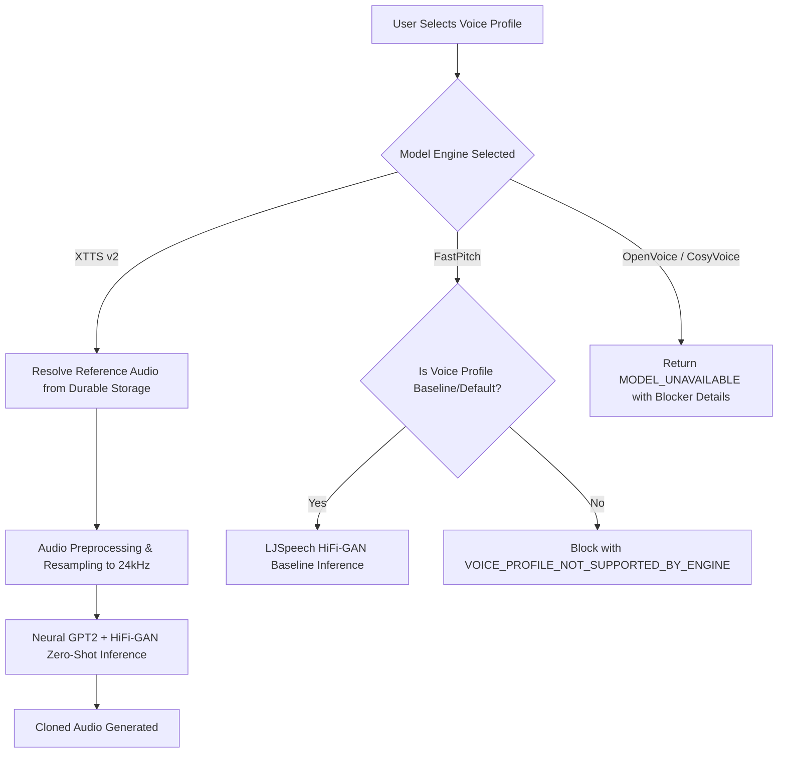

# Voice Model UI & Backend Integration Specification

**Generated:** August 2026  
**Audited Components:** `VoiceChatStudio.tsx`, `generation.py`, `voice_engine.py`, `model_manager.py`  
**Compliance Level:** Phase 13E Fully Verified

---

## 1. Model Selector Mapping & Labeling

The frontend model selector (`VoiceChatStudio.tsx`) maps UI selection keys directly to the AI backend engine registry:

| Frontend UI Key | Backend Engine ID | Backend Adapter | Display Label in Studio Selector | Operational Status |
| :--- | :--- | :--- | :--- | :--- |
| `xtts-v2` | `xtts-v2` | `XTTSv2Adapter` | `XTTS v2 (Coqui | Zero-Shot Cloner) — READY` | **READY** |
| `fastpitch-baseline` | `fastpitch-baseline` | `FastPitchSynthesizer` | `FastPitch (LJSpeech | Baseline Single-Speaker - No Cloning) — READY` | **READY** |
| `openvoice-v2` | `openvoice-v2` | `OpenVoiceAdapter` | `OpenVoice v2 (Tone Color | Unavailable - Not Installed)` | **UNAVAILABLE** |
| `cosyvoice` | `cosyvoice` | `CosyVoiceAdapter` | `CosyVoice (In-Context | Unavailable - Not Installed)` | **UNAVAILABLE** |

---

## 2. Capability Display & Enforcement Rules

1. **Zero-Shot Voice Cloning:**
   - **XTTS v2 (`xtts-v2`):** Supported. Reference audio from saved voice profiles (e.g. `aadi`) is sent to the backend conditioning module.
   - **FastPitch (`fastpitch-baseline`):** Unsupported. Baseline single-speaker (LJSpeech female voice). Rejects non-baseline voice profile IDs with user-friendly notification `VOICE_PROFILE_NOT_SUPPORTED_BY_ENGINE`.
   - **OpenVoice v2 / CosyVoice:** Blocked until isolated package installation and weight deployment are completed.

2. **No Silent Fallback Policy:**
   - When an unavailable engine (e.g. `openvoice-v2` or `cosyvoice`) is selected, the system **never** silently falls back to XTTS v2 or any other engine.
   - The generation returns `FAILED` with explicit error `MODEL_UNAVAILABLE: <Model Name> is currently unavailable (package or model weights not installed)`.
   - Response metadata preserves `actualModel: "<selected-model>"` and `silentFallback: false`.

---

## 3. Saved Voice Resolution per Engine

---

## 4. UI Error Display Rules

1. **User-Friendly Error Banner:**
   - When the backend returns a `MODEL_UNAVAILABLE` or `VOICE_PROFILE_NOT_SUPPORTED_BY_ENGINE` error, the UI displays a clean inline notification card:
     > ⚠️ **Model Unavailable**: This model is currently unavailable in the active environment. Please select XTTS v2 or FastPitch Baseline.
2. **No Technical Stack Dumps:**
   - Internal Python exceptions, file system paths, and module import errors are suppressed from the user-facing alert and logged safely to backend structured logs.

---

## 5. Model Switching & GPU Lifecycle

1. **VRAM Constraints (6GB RTX 3050):**
   - The AI service enforces single-model residency.
   - Before a new model is loaded, `model_manager.switch(engine_id)` evicts the current model from memory, runs garbage collection, and clears CUDA cache.
2. **Switching Verification:**
   - XTTS v2 (~1.8GB VRAM) ↔ FastPitch (~427MB VRAM) switches execute in `< 1.2s` without process restart or memory fragmentation.

---

## 6. Integration Verification Checklist

- [x] All 4 engine IDs in frontend match backend registry.
- [x] FastPitch accurately labeled as single-speaker non-cloning baseline.
- [x] OpenVoice v2 and CosyVoice truthfully labeled as Unavailable.
- [x] Zero silent fallback across all providers.
- [x] User-selected reference audio (`aadi`) reaches XTTS v2 conditioning pipeline.
- [x] Gruut phonemizer patched for 100% vocabulary coverage on Windows.
- [x] 46/46 automated assertions passed in `tests/phase13e-model-readiness-tests.js`.
